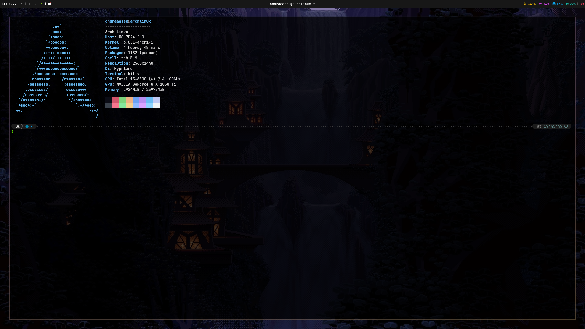

These are my Hyprland dotfiles.
They contain my configs and my own binaries, so put the configs in ~/.config/ and the binaries in /bin/
Dependency list:
  - Hyprland
  - Waybar
  - Foot
  - swww
  - btop
  - nvim
  - ranger
  - wofi
  - rofi
  - zsh
  - oh-my-zsh
  - powerlevel10k
  - nerd-fonts
  - wlogout
  - nemo

My recommendations:
  - nwg-look
  - vscode
  - pulseaudio
  - wireplumber
  - a bit of skill
  - some intelligence

